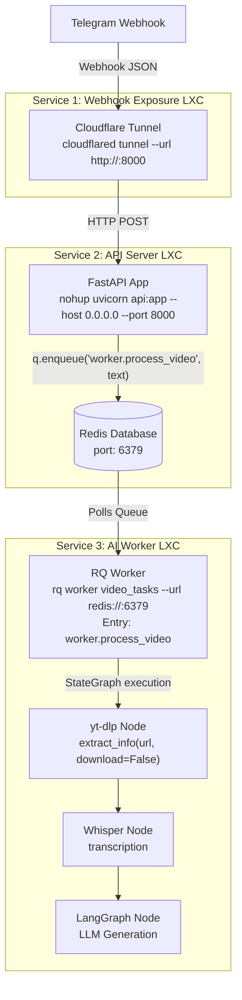

# Blogger

This pipeline automatically extracts information from YouTube links sent via Telegram, transcribes the audio, conducts research, and generates a fully formatted blog post for an Astro-based static site.

## Architecture



- **Webhook Gateway:** Cloudflare Tunnels
- **API & Queue:** FastAPI, Redis, RQ (Redis Queue)
- **AI Worker:** LangGraph, yt-dlp, Whisper, LLM APIs

## Prerequisites
- Proxmox (or similar) environment with LXC/VMs for distributed processing.
- Python 3.10+
- Redis Server
- `ffmpeg` (for audio processing)
- Supported JS runtime (e.g., `deno`) for `yt-dlp`.

## Setup Instructions

1. **Clone the repository:**
   ```bash
   git clone https://github.com/your-username/blogger.git
   cd blogger
   ```

2. **Set up the virtual environment:**
   ```bash
   python3 -m venv venv
   source venv/bin/activate
   pip install -r requirements.txt
   ```

3. **Environment Variables:**
   Copy the example environment file and fill in your secrets.
   ```bash
   cp .env.example .env
   # Edit .env with your favorite editor (e.g., nano .env)
   ```

## Running the Services

> **Note:** This architecture is designed so that these 3 services (Cloudflare Tunnel, API Server + Redis, RQ Worker) can run on **separate LXC machines** for distributed processing. Since Service 1 (Tunnel) and Service 3 (Worker) both connect to Service 2 (API Server), they must use the API Server's IP address in their configuration.

### 1. Cloudflare Tunnel (Webhook Exposure)
To allow Telegram to reach your local API server, you need to expose port 8000 to the internet. For quick testing without an account, you can use a temporary Cloudflare Tunnel. Replace `<API_SERVER_IP>` with your API Server LXC's IP (e.g., `192.168.1.202`):
```bash
cloudflared tunnel --url http://<API_SERVER_IP>:8000
```

*Note: This creates a temporary URL that changes every time you restart the tunnel. You will see an output like `https://random-words.trycloudflare.com`.* You must use this generated URL to configure your Telegram Webhook.

### 2. API Server
Run the FastAPI application in the background to listen for Telegram webhooks. Here, `uvicorn api:app` tells the server to look inside the `api.py` file and serve the FastAPI instance named `app`. The `nohup` command ensures the server keeps running even if you disconnect from your terminal session, while routing all logs to `nohup.out`:
```bash
nohup uvicorn api:app --host 0.0.0.0 --port 8000 > nohup.out 2>&1 &
```
To check the server status and watch the live logs, use:
```bash
tail -f nohup.out
```

### 3. RQ Worker
Run the background worker to process the tasks. This command listens to the `video_tasks` queue. When the API server enqueues a job (e.g., `worker.process_video`), this RQ instance loads the `worker.py` file and executes its `process_video` function. We explicitly pass the `--url` argument to connect to the Redis server (which runs alongside the API Server). Replace `<API_SERVER_IP>` with your API Server LXC's IP address (e.g., `192.168.1.202`):
```bash
rq worker video_tasks --url redis://<API_SERVER_IP>:6379
```
