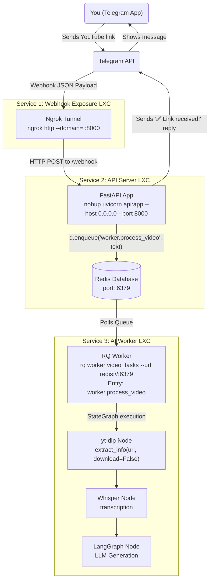

# Blogger

[](https://opensource.org/licenses/MIT)
[](https://www.python.org/downloads/)

This pipeline automatically extracts information from YouTube links sent via Telegram, transcribes the audio, conducts research, and generates a fully formatted blog post for an Astro-based static site.

## Table of Contents
- [Architecture](#architecture)
- [Prerequisites](#prerequisites)
- [Setup Instructions](#setup-instructions)
- [Running the Services](#running-the-services)
- [Contributing](#contributing)
- [License](#license)

## Architecture

- **Webhook Gateway:** Ngrok Tunnel
- **API & Queue:** FastAPI, Redis, RQ (Redis Queue)
- **AI Worker:** LangGraph, yt-dlp, Whisper, LLM APIs



## Prerequisites
- Distributed processing environment (e.g., Proxmox, Docker, or bare metal).
- Python 3.10+
- Redis Server
- `ffmpeg` (for audio processing)
- Supported JS runtime (e.g., `deno`) for `yt-dlp`.

## Setup Instructions

1. **Create Telegram Bot:**
   - Open Telegram and search for **@BotFather**.
   - Send `/newbot` and follow the prompts to create your bot.
   - Save the provided HTTP API Token. This will be your `TELEGRAM_BOT_TOKEN`.

2. **Clone the repository:**
   ```bash
   git clone https://github.com/your-username/blogger.git
   cd blogger
   ```

3. **Set up the virtual environment:**
   ```bash
   python3 -m venv venv
   source venv/bin/activate
   pip install -r requirements.txt
   ```

4. **Environment Variables:**
   Copy the example environment file and fill in your secrets.
   ```bash
   cp .env.example .env
   # Edit .env with your favorite editor (e.g., nano .env)
   ```

## Running the Services

> **Note:** This architecture is designed so that these 3 services (Ngrok Tunnel, API Server + Redis, RQ Worker) can run on **separate machines/containers** for distributed processing (e.g. LXC nodes). Since Service 1 (Tunnel) and Service 3 (Worker) both connect to Service 2 (API Server), they must use the API Server's IP address in their configuration (for example, `192.168.1.202`). If you are running everything on a single machine, you can simply use `localhost` or `127.0.0.1`.

### 1. Ngrok Tunnel (Webhook Exposure)
To allow Telegram to reach your local API server reliably, we use an Ngrok static domain running as a systemd service.

**1.1. Ngrok Dashboard and Static Domain Setup**
1. **Create an Account:** Go to [ngrok.com](https://ngrok.com/) to create a free account.
2. **Get Authtoken:** Go to **Getting Started > Your Authtoken** and copy your token.
3. **Get Static Domain:** Go to **Cloud Edge > Domains** and create a free static domain (e.g., `upward-marmot-profound.ngrok-free.app`).

**1.2. Installing Ngrok on Node 1 (Gateway)**
Log into the Gateway node console (e.g. `192.168.1.201`) as `root` and install Ngrok:

```bash
wget https://bin.equinox.io/c/bNyj1mQVY4c/ngrok-v3-stable-linux-amd64.tgz
tar -xvzf ngrok-v3-stable-linux-amd64.tgz -C /usr/local/bin
```

Authorize Ngrok using your Authtoken:
```bash
ngrok config add-authtoken <YOUR_TOKEN_HERE>
```

**1.3. Running Ngrok as a Persistent System Service**
Create a `systemd` service to run Ngrok automatically and forward traffic to Node 2 (e.g. `192.168.1.202:8000`). If running locally, replace the IP with `localhost:8000`.

```bash
nano /etc/systemd/system/ngrok.service
```

Add the following (replace `--domain` with your static domain and use your API node IP):

```ini
[Unit]
Description=Ngrok Tunnel for Telegram Webhook
After=network.target

[Service]
ExecStart=/usr/local/bin/ngrok http --domain=<YOUR_STATIC_DOMAIN_HERE> 192.168.1.202:8000
Restart=always
RestartSec=5
User=root

[Install]
WantedBy=multi-user.target
```

Enable and start the service:
```bash
systemctl daemon-reload
systemctl enable --now ngrok
systemctl status ngrok
```
*(Ensure it shows `active (running)`).*

**1.4. Set the Telegram Webhook**
Notify Telegram of your webhook address by visiting this URL in your browser:

```text
https://api.telegram.org/bot<YOUR_BOT_TOKEN>/setWebhook?url=https://<YOUR_STATIC_DOMAIN_HERE>/webhook
```

You should see a JSON response: `{"ok":true,"result":true,"description":"Webhook was set"}`. Your pipeline infrastructure is now ready to receive messages.

### 2. API Server
Run the FastAPI application in the background to listen for Telegram webhooks. Here, `uvicorn api:app` tells the server to look inside the `api.py` file and serve the FastAPI instance named `app`. The `nohup` command ensures the server keeps running even if you disconnect from your terminal session, while routing all logs to `nohup.out`:
```bash
nohup uvicorn api:app --host 0.0.0.0 --port 8000 > nohup.out 2>&1 &
```
To check the server status and watch the live logs, use:
```bash
tail -f nohup.out
```

### 3. RQ Worker
Run the background worker to process the tasks. This command listens to the `video_tasks` queue. When the API server enqueues a job (e.g., `worker.process_video`), this RQ instance loads the `worker.py` file and executes its `process_video` function. 

We explicitly pass the `--url` argument to connect to the Redis server. Replace `<API_SERVER_IP>` with your API Server node's IP address (e.g., `192.168.1.202`) or `localhost` if running locally:
```bash
rq worker video_tasks --url redis://<API_SERVER_IP>:6379
```

## Contributing
Contributions are welcome! Please feel free to submit a Pull Request.

1. Fork the repository
2. Create your feature branch (`git checkout -b feature/AmazingFeature`)
3. Commit your changes (`git commit -m 'Add some AmazingFeature'`)
4. Push to the branch (`git push origin feature/AmazingFeature`)
5. Open a Pull Request

## License
This project is licensed under the MIT License - see the [LICENSE](LICENSE) file for details.
