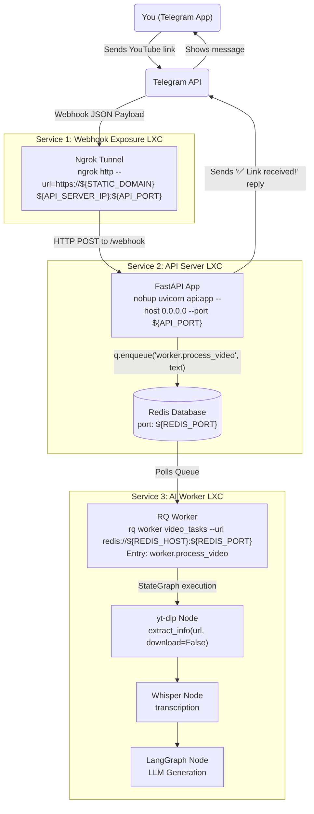

# Blogger

[](https://opensource.org/licenses/MIT)
[](https://www.python.org/downloads/)

This pipeline automatically extracts information from YouTube links sent via Telegram, transcribes the audio, conducts research, and generates a fully formatted blog post for an Astro-based static site.

## Table of Contents
- [Architecture](#architecture)
- [Prerequisites](#prerequisites)
- [Setup Instructions](#setup-instructions)
- [Running the Services](#running-the-services)
- [Contributing](#contributing)
- [License](#license)

## Architecture

- **Webhook Gateway:** Ngrok Tunnel
- **API & Queue:** FastAPI, Redis, RQ (Redis Queue)
- **AI Worker:** LangGraph, yt-dlp, Whisper, LLM APIs



## Prerequisites
- Distributed processing environment (e.g., Proxmox, Docker, or bare metal).
- Python 3.10+
- Redis Server
- `ffmpeg`
- Supported JS runtime (e.g., `deno`)

## Setup Instructions

1. **Create Telegram Bot:**
   - Search for **@BotFather** on Telegram.
   - Send `/newbot` and follow prompts.
   - Save the HTTP API Token. This will be your `TELEGRAM_BOT_TOKEN`.

2. **Clone the repository:**
   ```bash
   git clone https://github.com/atilileri/blogger.git
   cd blogger
   ```

3. **Environment Variables:**
   Copy the example environment file and fill in your secrets.
   ```bash
   cp .env.example .env
   ```
   **Important variables to set in `.env`:**
   - `TELEGRAM_BOT_TOKEN`: The token you received from @BotFather.
   - `API_SERVER_IP`: The IP address of the machine running the FastAPI server. Use `localhost` if running everything on a single machine.
   - `API_PORT`: The port for the FastAPI server (default `8000`).
   - `REDIS_HOST`: The IP address where Redis is hosted. Typically matches `API_SERVER_IP`.
   - `REDIS_PORT`: The port Redis is running on (default `6379`).
   - `NGROK_AUTH_TOKEN`: Your ngrok authentication token.
   - `STATIC_DOMAIN`: Your ngrok static domain (e.g., `upward-marmot.ngrok-free.app`).

4. **Set up the virtual environment (API & Worker Nodes Only):**
   If you are running the API Server or RQ Worker, you need to install the Python dependencies. The Ngrok tunnel does **not** require this step.
   ```bash
   python3 -m venv venv
   source venv/bin/activate
   pip install -r requirements.txt
   ```

## Running the Services

> **Note:** This architecture is designed so that these 3 services (Ngrok Tunnel, API Server + Redis, RQ Worker) can run on **separate machines/containers** for distributed processing (e.g. LXC nodes). Since Service 1 (Tunnel) and Service 3 (Worker) both connect to Service 2 (API Server), they must use the API Server's IP address in their configuration. If you are running everything on a single machine, you can simply use `localhost` or `127.0.0.1`.

**Note:** All services depend on the environment variables defined in `.env`. Ensure you have completed the [Setup Instructions](#setup-instructions) before starting them.

### 1. Ngrok Tunnel (Webhook Exposure)
To allow Telegram to reach your local API server reliably, we use an Ngrok static domain running as a systemd service.

**1.1. Ngrok Dashboard and Static Domain Setup**
1. **Create an Account:** Go to [ngrok.com](https://ngrok.com/).
2. **Get Authtoken:** Go to **Getting Started > Your Authtoken** to get your `${NGROK_AUTH_TOKEN}`.
3. **Get Static Domain:** Go to **Cloud Edge > Domains** and create a free static domain (your `${STATIC_DOMAIN}`).

**1.2. Installing Ngrok**
Install Ngrok on the gateway node:
```bash
wget https://bin.equinox.io/c/bNyj1mQVY4c/ngrok-v3-stable-linux-amd64.tgz
tar -xvzf ngrok-v3-stable-linux-amd64.tgz -C /usr/local/bin
```

Authorize Ngrok:
```bash
# Load env variables
set -a; source .env; set +a

ngrok config add-authtoken ${NGROK_AUTH_TOKEN}
```

**1.3. Running Ngrok as a Persistent System Service**
Create a `systemd` service to run Ngrok automatically and forward traffic to the API Server (Node 2).
```bash
nano /etc/systemd/system/ngrok.service
```

Add the following configuration (replace `/full/path/to/blogger/.env` with your actual path):
```ini
[Unit]
Description=Ngrok Tunnel for Telegram Webhook
After=network.target

[Service]
EnvironmentFile=/full/path/to/blogger/.env
ExecStart=/usr/local/bin/ngrok http --url=https://${STATIC_DOMAIN} ${API_SERVER_IP}:${API_PORT}
Restart=always
RestartSec=5
User=root

[Install]
WantedBy=multi-user.target
```

Enable and start the service:
```bash
systemctl daemon-reload
systemctl enable --now ngrok
systemctl status ngrok
```
*(Ensure it shows `active (running)`).*

Use 
```
journalctl -fu ngrok.service
```
to watch live logs.

**1.4. Set the Telegram Webhook**
Notify Telegram of your webhook address by executing:
```bash
set -a; source .env; set +a
curl "https://api.telegram.org/bot${TELEGRAM_BOT_TOKEN}/setWebhook?url=https://${STATIC_DOMAIN}/webhook"
```

You should see a JSON response: `{"ok":true,"result":true,"description":"Webhook was set"}`. Your pipeline infrastructure is now ready to receive messages.

### 2. API Server
**Note**: Ensure [Setup Instructions](#setup-instructions) are complete.

Run the FastAPI application in the background to listen for Telegram webhooks. Here, `uvicorn api:app` tells the server to look inside the `api.py` file and serve the FastAPI instance named `app`. The `nohup` command ensures the server keeps running even if you disconnect from your terminal session, while routing all logs to `nohup.out`.

```bash
set -a; source .env; set +a
nohup uvicorn api:app --host 0.0.0.0 --port ${API_PORT} > nohup.out 2>&1 &
```
To check the server status and watch the live logs, use:
```bash
tail -f nohup.out
```

### 3. RQ Worker
**Note**: Ensure [Setup Instructions](#setup-instructions) are complete.

Run the background worker to process the tasks. This command listens to the `video_tasks` queue. When the API server enqueues a job (e.g., `worker.process_video`), this RQ instance loads the `worker.py` file and executes its `process_video` function. 

```bash
set -a; source .env; set +a
rq worker video_tasks --url redis://${REDIS_HOST}:${REDIS_PORT}
```

## Contributing
Contributions are welcome! Please feel free to submit a Pull Request.

1. Fork the repository
2. Create your feature branch (`git checkout -b feature/AmazingFeature`)
3. Commit your changes (`git commit -m 'Add some AmazingFeature'`)
4. Push to the branch (`git push origin feature/AmazingFeature`)
5. Open a Pull Request

## License
This project is licensed under the MIT License - see the [LICENSE](LICENSE) file for details.
