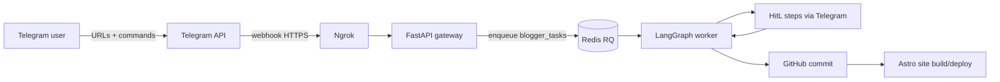
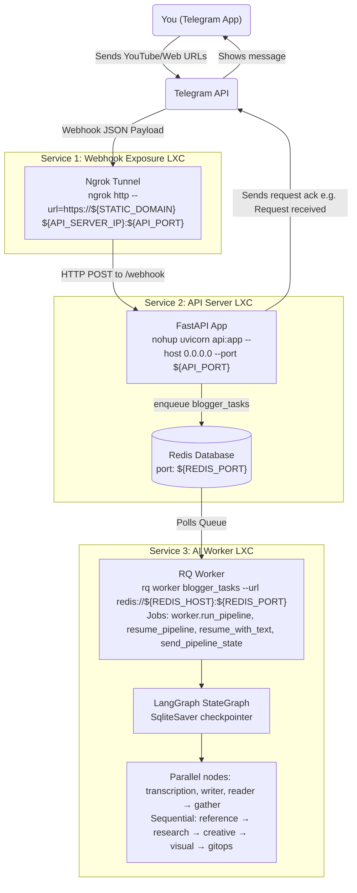
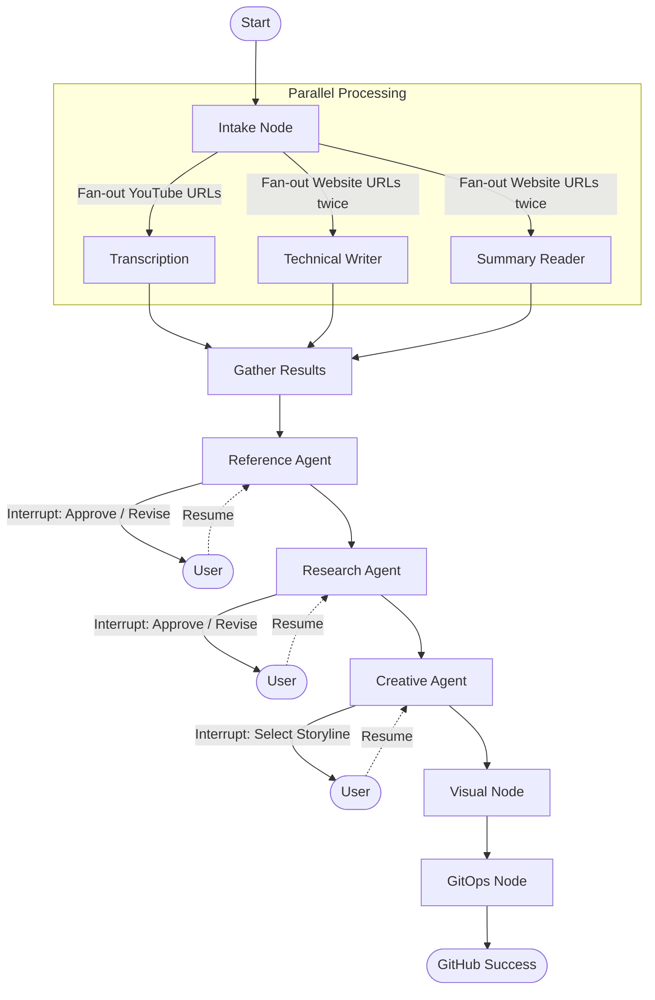

# Blogger

[](https://opensource.org/licenses/MIT)
[](https://www.python.org/downloads/)

This pipeline takes **YouTube and/or arbitrary website URLs** you send via Telegram, fans work out to parallel extraction paths (video transcription branch vs web writer/reader branch), gathers results, runs reference and research with **human-in-the-loop** approvals through inline keyboards and text revisions, generates bilingual blog content and a hero image, then pushes Markdown and assets into a GitHub repo that backs an **Astro** static site.

## Table of Contents
- [Pipeline at a glance](#pipeline-at-a-glance)
- [Architecture](#architecture)
- [Prerequisites](#prerequisites)
- [Setup Instructions](#setup-instructions)
- [Running the Services](#running-the-services)
  - [Telegram bot commands](#telegram-bot-commands-and-api-surface)
- [Local Integration Testing](#local-integration-testing)
- [Contributing](#contributing)
- [License](#license)
- [LangGraph Pipeline (New Architecture)](#langgraph-pipeline-new-architecture)

## Pipeline at a glance

High-level journey from chat message to deployed content:


```mermaid
flowchart LR
    TG[Telegram user] -->|"URLs + commands"| TelegramAPI[Telegram API]
    TelegramAPI -->|webhook HTTPS| Tunnel[Ngrok]
    Tunnel --> GW[FastAPI gateway]
    GW -->|"enqueue blogger_tasks"| Q[(Redis RQ)]
    Q --> Worker[LangGraph worker]
    Worker --> HitL[HitL steps via Telegram]
    HitL --> Worker
    Worker --> GH[GitHub commit]
    GH --> Astro[Astro site build/deploy]
```

- **Webhook path:** Telegram POSTs updates to `/webhook` on your public URL (typically via ngrok forwarding to `${API_SERVER_IP}:${API_PORT}`).
- **Work dispatch:** The API enqueues RQ jobs on queue `blogger_tasks`; the worker runs the LangGraph app compiled in `worker.py`, persists checkpoints to SQLite (`CHECKPOINT_DB`), and uses Telegram APIs for approvals and revisions.
- **Output:** GitOps pushes content into paths like `src/content/blog` and `public/images/blog` (configurable via `BLOG_*` variables) for your Astro project.

## Architecture

- **Webhook Gateway:** Ngrok Tunnel
- **API & Queue:** FastAPI, Redis, RQ (Redis Queue); queue name **`blogger_tasks`**
- **AI Worker:** LangGraph (`SqliteSaver` / `CHECKPOINT_DB`), yt-dlp, faster-whisper (dependency stack—see implementation note below), Google Gemini (`GOOGLE_API_KEY`), Tavily (`TAVILY_API_KEY`), GitHub Git Data API (`GITHUB_TOKEN`, `GITHUB_REPO`)


```mermaid
flowchart TD
    %% External
    User("You (Telegram App)")
    TelegramAPI("Telegram API")

    %% Service 1: Webhook Exposure
    subgraph LXC_1 ["Service 1: Webhook Exposure LXC"]
        Tunnel["Ngrok Tunnel<br/>ngrok http --url=https://${STATIC_DOMAIN} ${API_SERVER_IP}:${API_PORT}"]
    end

    %% Service 2: API & Redis
    subgraph LXC_2 ["Service 2: API Server LXC<br/>IP: ${API_SERVER_IP}"]
        API["FastAPI App<br/>nohup uvicorn api:app --host 0.0.0.0 --port ${API_PORT}"]
        Redis[("Redis Database<br/>port: ${REDIS_PORT}")]
    end

    %% Service 3: RQ Worker
    subgraph LXC_3 ["Service 3: AI Worker LXC"]
        Worker["RQ Worker<br/>rq worker blogger_tasks --url redis://${REDIS_HOST}:${REDIS_PORT}<br/>Jobs: worker.run_pipeline, resume_pipeline, resume_with_text, send_pipeline_state"]
        Graph["LangGraph StateGraph<br/>SqliteSaver checkpointer"]
        Jobs["Parallel nodes: transcription, writer, reader → gather<br/>Sequential: reference → research → creative → visual → gitops"]
    end

    %% Connections
    User -->|"Sends YouTube/Web URLs"| TelegramAPI
    TelegramAPI -->|"Webhook JSON Payload"| Tunnel
    Tunnel -->|"HTTP POST to /webhook"| API
    API -->|"Sends request ack e.g. Request received"| TelegramAPI
    TelegramAPI -->|"Shows message"| User
    API -->|"enqueue blogger_tasks"| Redis
    Redis -->|"Polls Queue"| Worker
    Worker --> Graph
    Graph --> Jobs
```

## Prerequisites
- Distributed processing environment (e.g., Proxmox, Docker, or bare metal).
- Python 3.10+
- Redis Server
- `ffmpeg` (audio handling when using yt-dlp / transcription pipelines)
- **Worker / AI:** `GOOGLE_API_KEY` for Gemini; `TAVILY_API_KEY` for the research agent; optional GPU or CPU suitable for **faster-whisper** once wired to real audio decoding
- **GitOps:** `GITHUB_TOKEN` with repo contents write access and a target `GITHUB_REPO` ( Astro content repo—not built inside this repo)
- **Checkpoints:** A writable filesystem path for `CHECKPOINT_DB` (SQLite)

## Setup Instructions

1. **Create Telegram Bot:**
   - Search for **@BotFather** on Telegram.
   - Send `/newbot` and follow prompts.
   - Save the HTTP API Token. This will be your `TELEGRAM_BOT_TOKEN`.

2. **Clone the repository:**
   ```bash
   git clone https://github.com/atilileri/blogger.git
   cd blogger
   ```

3. **Environment Variables:**
   Copy the example environment file and fill in your secrets.
   ```bash
   cp .env.example .env
   ```
   **Important variables to set in `.env` (grouped by concern):**

   **Telegram & public URL**
   - `TELEGRAM_BOT_TOKEN`: The token you received from @BotFather.
   - `NGROK_AUTH_TOKEN`: Your ngrok authentication token.
   - `STATIC_DOMAIN`: Your ngrok static domain (e.g., `upward-marmot.ngrok-free.app`).

   **API & Redis**
   - `API_SERVER_IP`: The IP address of the machine running the FastAPI server. Use `localhost` if running everything on a single machine.
   - `API_PORT`: The port for the FastAPI server (default `8000`).
   - `REDIS_HOST`: The IP address where Redis is hosted. Typically matches `API_SERVER_IP`.
   - `REDIS_PORT`: The port Redis is running on (default `6379`).

   **Security**
   - `ALLOWED_CHAT_IDS`: Comma-separated Telegram chat IDs that may use the bot. Others receive `rejected` and are not queued.

   **External APIs**
   - `GOOGLE_API_KEY`: Google AI (Gemini) for LLM steps in agents, creative, prompts, etc.
   - `TAVILY_API_KEY`: Web research in the research agent.

   **Worker persistence**
   - `CHECKPOINT_DB`: Path to the SQLite checkpoints file (directory must exist or be creatable).

   **GitOps (Astro consumer repository)**
   - `GITHUB_TOKEN`: PAT with permission to push to the content repository.
   - `GITHUB_REPO`: Target repo in `owner/name` form.
   - `BLOG_CONTENT_PATH`: Repo-relative path for blog Markdown (example: `src/content/blog`).
   - `BLOG_IMAGES_PATH`: Repo-relative path for images (example: `public/images/blog`).

   **Image generation**
   - `IMAGE_API_PROVIDER`: Declared in `.env.example` (e.g. `pollinations`); visual generation in code currently uses Pollinations URLs via Gemini-derived prompts—not yet switched off this env value.

4. **Set up the virtual environment (API & Worker Nodes Only):**
   If you are running the API Server or RQ Worker, you need to install Python dependencies. The Ngrok tunnel does **not** require this step.

   **Split deployment (recommended for separate LXC/VM roles):**
   - On the **API gateway** machine (only needs HTTP + Redis + RQ client):
     ```bash
     python3 -m venv venv
     source venv/bin/activate
     pip install -r requirements-api.txt
     ```
   - On the **worker** machine (full LangGraph + AI stack):
     ```bash
     python3 -m venv venv
     source venv/bin/activate
     pip install -r requirements-worker.txt
     ```

   **Single-machine or quick dev:** Root `requirements.txt` lists a shorter combined subset (FastAPI stack + core LangGraph); it does **not** match the worker’s full transitive set (`requirements-worker.txt` is the source of truth for the AI node). Prefer the split files when mirroring production.

## Running the Services

> **Note:** This architecture is designed so that these 3 services (Ngrok Tunnel, API Server + Redis, RQ Worker) can run on **separate machines/containers** for distributed processing (e.g. LXC nodes). Since Service 1 (Tunnel) and Service 3 (Worker) both connect to Service 2 (API Server), they must use the API Server's IP address in their configuration. If you are running everything on a single machine, you can simply use `localhost` or `127.0.0.1`.

**Note:** All services depend on the environment variables defined in `.env`. Ensure you have completed the [Setup Instructions](#setup-instructions) before starting them.

### Telegram bot commands and API surface

- **`/cancel` or `/reset`:** Clears the session lock (`get_lock_key`) and Telegram thread helpers so a new run can start.
- **`/state`:** Enqueues `worker.send_pipeline_state` so the worker replies with pipeline status detail.
- **`/help`:** Sends inline help describing URL-based starts and commands.
- **Plain URLs in a message (with entities):** When the session lock is acquired, the API acknowledges with a **request received** style message (see `telegram_webhook` in `api.py`) and enqueues **`worker.run_pipeline`** with the full Telegram message dict.
- **Callback queries (inline keyboards):** Enqueue **`worker.resume_pipeline`** so LangGraph resumes from interrupts with approve/revise/storyline actions.
- **Text while locked (revision):** If the user sends non-command text while the lock is held, the API forwards **`worker.resume_with_text`**.
- **`GET /health`:** JSON health check including a Redis ping (useful for monitoring).
- Unauthorized `ALLOWED_CHAT_IDS` traffic returns `{"status":"rejected"}` without notifying the user (reject path is intentionally quiet in code).

Scheduled cleanup: **`check_session_timeout`** is enqueued with **`timedelta(hours=1)`** after lock acquisition so stale locks notify and clear.

### 1. Ngrok Tunnel (Webhook Exposure)
To allow Telegram to reach your local API server reliably, we use an Ngrok static domain running as a systemd service.

**1.1. Ngrok Dashboard and Static Domain Setup**
1. **Create an Account:** Go to [ngrok.com](https://ngrok.com/).
2. **Get Authtoken:** Go to **Getting Started > Your Authtoken** to get your `${NGROK_AUTH_TOKEN}`.
3. **Get Static Domain:** Go to **Cloud Edge > Domains** and create a free static domain (your `${STATIC_DOMAIN}`).

**1.2. Installing Ngrok**
Install Ngrok on the gateway node:
```bash
wget https://bin.equinox.io/c/bNyj1mQVY4c/ngrok-v3-stable-linux-amd64.tgz
tar -xvzf ngrok-v3-stable-linux-amd64.tgz -C /usr/local/bin
```

Authorize Ngrok:
```bash
# Load env variables
set -a; source .env; set +a

ngrok config add-authtoken ${NGROK_AUTH_TOKEN}
```

**1.3. Running Ngrok as a Persistent System Service**
Create a `systemd` service to run Ngrok automatically and forward traffic to the API Server (Node 2).
```bash
nano /etc/systemd/system/ngrok.service
```

Add the following configuration (replace `/full/path/to/blogger/.env` with your actual path):
```ini
[Unit]
Description=Ngrok Tunnel for Telegram Webhook
After=network.target

[Service]
EnvironmentFile=/full/path/to/blogger/.env
ExecStart=/usr/local/bin/ngrok http --url=https://${STATIC_DOMAIN} ${API_SERVER_IP}:${API_PORT}
Restart=always
RestartSec=5
User=root

[Install]
WantedBy=multi-user.target
```

Enable and start the service:
```bash
systemctl daemon-reload
systemctl enable --now ngrok
systemctl status ngrok
```
*(Ensure it shows `active (running)`).*

Use 
```
journalctl -fu ngrok.service
```
to watch live logs.

**1.4. Set the Telegram Webhook**
Notify Telegram of your webhook address by executing:
```bash
set -a; source .env; set +a
curl "https://api.telegram.org/bot${TELEGRAM_BOT_TOKEN}/setWebhook?url=https://${STATIC_DOMAIN}/webhook"
```

You should see a JSON response: `{"ok":true,"result":true,"description":"Webhook was set"}`. Your pipeline infrastructure is now ready to receive messages.

### 2. API Server
**Note**: Ensure [Setup Instructions](#setup-instructions) are complete.

Run the FastAPI application in the background to listen for Telegram webhooks. Here, `uvicorn api:app` tells the server to look inside the `api.py` file and serve the FastAPI instance named `app`. The `nohup` command ensures the server keeps running even if you disconnect from your terminal session, while routing all logs to `nohup.out`.

```bash
set -a; source .env; set +a
nohup uvicorn api:app --host 0.0.0.0 --port ${API_PORT} > nohup.out 2>&1 &
```
To check the server status and watch the live logs, use:
```bash
tail -f nohup.out
```

Expose **`GET /health`** alongside `/webhook` for simple uptime checks (`redis` ping in JSON).

### 3. RQ Worker
**Note**: Ensure [Setup Instructions](#setup-instructions) are complete.

Run the background worker to process the tasks. This command listens to the **`blogger_tasks`** queue. The API enqueues dotted paths on RQ pointing at callables exported from **`worker`** (Python module [`worker.py`](worker.py)). Typical mappings:

| Trigger | Enqueued callable |
|---------|-------------------|
| New unlocked message starting a pipeline | `worker.run_pipeline` |
| Inline keyboard callbacks | `worker.resume_pipeline` |
| Reply text during lock | `worker.resume_with_text` |
| `/state` command | `worker.send_pipeline_state` |

```bash
set -a; source .env; set +a
rq worker blogger_tasks --url redis://${REDIS_HOST}:${REDIS_PORT}
```

## Local Integration Testing

To ensure the pipeline is robust and handles transitions correctly without incurring LLM costs or spamming Telegram, we use a **Hybrid Local Testing** setup. This setup mocks all external I/O (Telegram, LLMs, YouTube) while running the actual LangGraph and business logic.

### 1. Setup Test Environment
Install the testing dependencies (includes **pytest**, **pytest-mock**, and **fakeredis**, which replaces live Redis calls in [`tests/conftest.py`](tests/conftest.py)):
```bash
pip install -r requirements-test.txt
```

### 2. Automated Scenarios (Pytest)
We use `pytest` to run predefined end-to-end scenarios (Happy Path, Revisions, Error Handling). 
- **Mocking Strategy**: Low-level network calls (LLM invokes, Telegram API) are intercepted. LangChain prompts and LangGraph state logic are fully exercised.
- **Run all tests:**
  ```bash
  pytest -s tests/test_scenarios.py
  ```
  *(The `-s` flag is important to see the simulated Telegram messages in your console).*

### 3. Interactive CLI Simulator
If you want to manually step through the pipeline and choose responses at each "Human-in-the-Loop" step without using a real Telegram bot:
```bash
python simulator.py
```
- This script will pause at each interrupt and ask for your input (Approve, Revise, or specific story index).
- It prints all logs and simulated Telegram outputs directly to the terminal.

### What is being tested?
- **LangGraph State Transitions**: Ensuring nodes follow the correct path based on user decisions.
- **Human-in-the-Loop (HitL)**: Verifying the graph correctly interrupts and resumes from checkpoints.
- **Redis & Mutex**: Confirming sessions are locked during processing and unlocked on completion or failure.
- **Error Handling**: Validating that system or logic crashes trigger user notifications and session cleanups.

## Contributing
Contributions are welcome! Please feel free to submit a Pull Request.

1. Fork the repository
2. Create your feature branch (`git checkout -b feature/AmazingFeature`)
3. Commit your changes (`git commit -m 'Add some AmazingFeature'`)
4. Push to the branch (`git push origin feature/AmazingFeature`)
5. Open a Pull Request

## License
This project is licensed under the MIT License - see the [LICENSE](LICENSE) file for details.

---

## LangGraph Pipeline (New Architecture)

The system has been upgraded to a **Multi-Agent LangGraph Pipeline** with distributed processing and **Human-in-the-Loop (HitL)** validation steps.

### Detailed Workflow

Routes after **intake** follow `route_to_parallel` in `worker.py`: each YouTube URL fans out to **transcription**; each non-YouTube URL fans out twice to **writer** (technical) and **reader** (summary). All parallel sends converge on **gather**, then **reference** → **research** → **creative** (conditional HitL revisits on **reference** and **research** while decisions are revise). **gather** merely logs and merges parallel outputs.


```mermaid
graph TD
    %% Entry
    Start([Start]) --> Intake[Intake Node]
    
    %% Parallel Processing
    subgraph Parallel ["Parallel Processing"]
        Intake -->|Fan-out YouTube URLs| Trans[Transcription]
        Intake -->|Fan-out Website URLs twice| Writer[Technical Writer]
        Intake -->|Fan-out Website URLs twice| Reader[Summary Reader]
    end
    
    %% Synchronization
    Trans --> Gather[Gather Results]
    Writer --> Gather
    Reader --> Gather
    
    %% HitL Chain
    Gather --> Ref[Reference Agent]
    Ref -->|"Interrupt: Approve / Revise"| User1([User])
    User1 -.->|Resume| Ref
    
    Ref --> Research[Research Agent]
    Research -->|"Interrupt: Approve / Revise"| User2([User])
    User2 -.->|Resume| Research
    
    Research --> Creative[Creative Agent]
    Creative -->|"Interrupt: Select Storyline"| User3([User])
    User3 -.->|Resume| Creative
    
    %% Finalization
    Creative --> Visual[Visual Node]
    Visual --> GitOps[GitOps Node]
    GitOps --> Success([GitHub Success])
```

### Implementation status vs dependency stack

- **Included in worker requirements:** `langgraph-checkpoint-sqlite`, `langchain-google-genai`, `yt-dlp`, **`faster-whisper`**, `tavily-python`, `gitpython`, `httpx`, content tooling (`trafilatura`, `beautifulsoup4`), etc.—ready for fully wired ingestion.
- **Current code behavior:** The **transcription**, **reader**, and **technical writer** parallel nodes still return deterministic placeholder strings (“SIMULATED …”) rather than invoking yt-dlp/Whisper/full fetch pipelines. Downstream stages (**reference**, **research**, **creative**, **visual** via Gemini + Pollinations, **gitops** via GitHub API) execute real integrations when keys are present.
- This split keeps CI fast (`requirements-test.txt` + `fakeredis`) while documenting the eventual production toolchain.

### New Key Features

1.  **Distributed Requirements**:
    - `requirements-api.txt`: Minimal dependencies for the Gateway LXC (FastAPI, Redis, RQ, httpx).
    - `requirements-worker.txt`: Full AI stack for the Worker LXC (LangGraph, Gemini integrations, Tavily, yt-dlp, faster-whisper, etc.).
2.  **State Persistence**: Uses **`SqliteSaver`** (see `CHECKPOINT_DB`) so if the worker crashes or the host restarts the pipeline may resume check-pointed graphs.
3.  **Bilingual Support**: Automatically generates and adaptively translates blog posts into both English and Turkish, sharing a unique `translationId`.
4.  **Security & Mutex**:
    - **Whitelist**: Only `ALLOWED_CHAT_IDS` can trigger the pipeline.
    - **Session Lock**: One active pipeline per user. Use `/cancel` to reset.
    - **Timeout**: After a new lock is acquired, an RQ delayed job runs **`check_session_timeout`** in **about one hour**, clearing orphaned locks with a Telegram notice if still present.

### Multi-LXC Deployment

1.  **Node 2 (Gateway)**:
    - Install `requirements-api.txt`.
    - Run `uvicorn api:app`.
2.  **Node 3 (Worker)**:
    - Install `requirements-worker.txt`.
    - Install `ffmpeg` and plan for **faster-whisper** workloads (CPU GPU per your infra).
    - Run `rq worker blogger_tasks`.
3.  **Shared**: Both nodes must point to the same **Redis** instance (Node 2).
